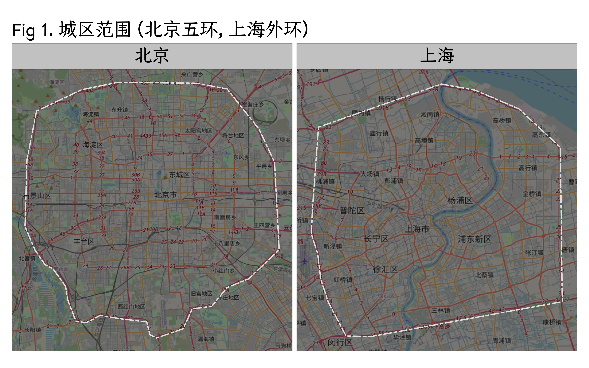
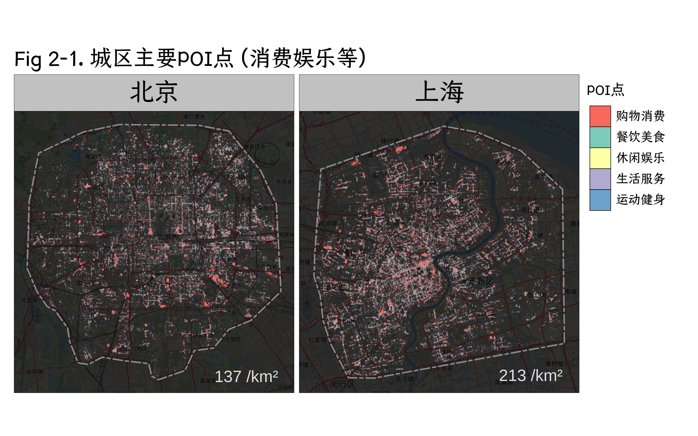
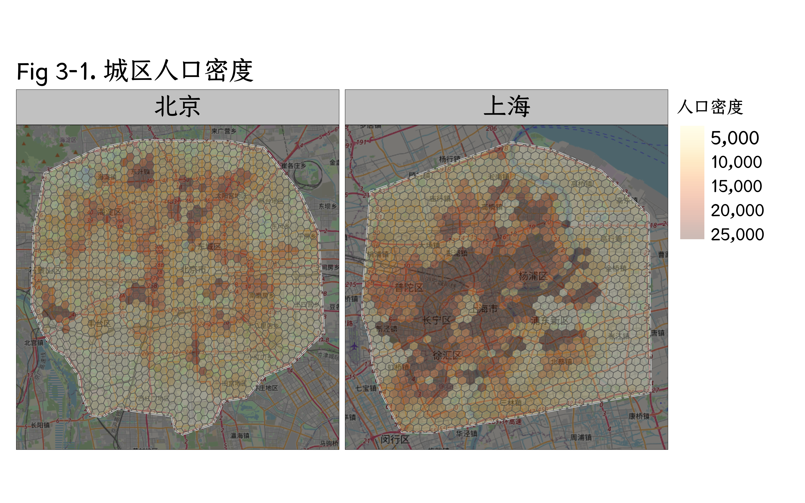
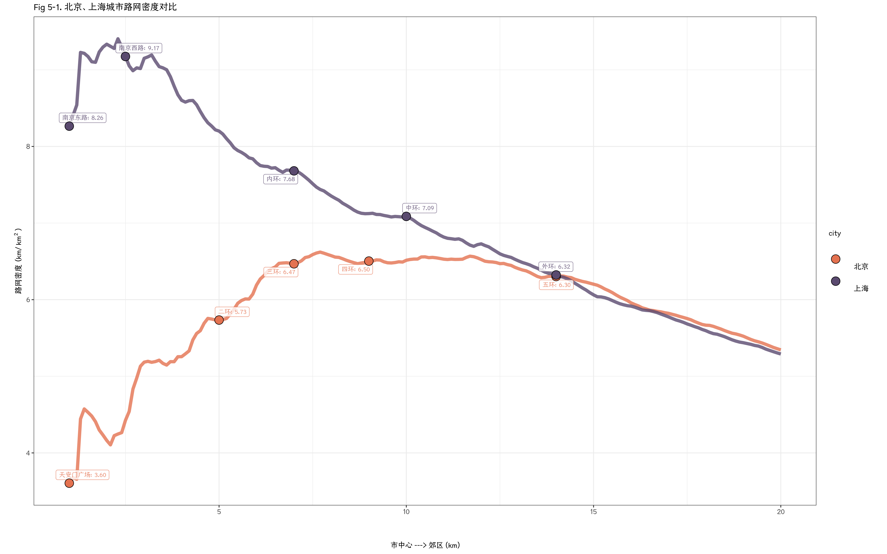

# Urban Accessibility Analysis · 北京为什么“显得更大”

**English** · [中文摘要](SUMMARY_CH.md) · [English summary](SUMMARY_EN.md) · [Article (WeChat, 中文)](https://mp.weixin.qq.com/s/ywQC_EmsF2VAiZprDFxhjg)

Why does everywhere feel far away in Beijing? This R project compares the main urban areas of **Beijing** (inside the 5th Ring Road) and **Shanghai** (inside the Outer Ring Road), with **Tianjin** and **Hangzhou** as extra reference points, using Amap POIs, gridded population and OpenStreetMap routing.



## Key findings

- **Bigger area, thinner services.** Beijing's main urban area is much larger, yet it has fewer shopping, dining, leisure and daily-service POIs per km², and fewer bus and metro stops per km², than Shanghai's.
- **People and shops don't line up.** Beijing's dense population cells are more scattered, and commercial density does not rise as fast as population density.
- **Trips are more roundabout.** For both short walks (0–3 km) and long drives (>10 km), Beijing's detour index (route distance ÷ straight-line distance) is systematically a few percentage points higher.
- **A coarser street grid.** Beijing has lower road density overall and especially within 5 km of the centre, where Shanghai has a much finer grid; compared with Tianjin and Hangzhou too, Beijing's 5 km core is still at the low end.

| POIs | Population | Road density |
|---|---|---|
|  |  |  |

See the [中文摘要](SUMMARY_CH.md) or [English summary](SUMMARY_EN.md) for the full write-up.

## Methods

### Spatial Analysis
- **POI Density Analysis** -- Points of interest (restaurants, shops, transit stations) per km², visualized as continuous heatmaps
- **Buffer/Concentric Ring Analysis** -- Metrics computed in 1km-interval rings radiating from city centers (up to 20km)
- **Spatial Intersection** -- POI counts within administrative polygons and buffer zones
- **Population-POI Mismatch** -- Comparing commercial resource distribution against population density

### Routing & Network Analysis
- **OSRM Route Calculation** -- Walking and driving routes computed for 10,000 population-weighted sample pairs per city using the OpenStreetMap Routing Machine
- **Detour Index** -- Ratio of actual route distance to straight-line (Euclidean) distance, measuring street network efficiency
- **Street Network Density** -- Kilometers of road per km² at varying distances from city centers

### Coordinate Systems
- **GCJ-02 to WGS-84 transformation** -- Converting Amap (Gaode) coordinates to standard WGS-84 using the custom `risingCoord` R package
- **Baidu to WGS-84** -- Additional coordinate system support

### Visualization
- Half-violin plots with embedded box plots (custom `geom_flat_violin` ggplot2 geometry)
- Density heatmaps with continuous color gradients
- Faceted multi-city comparative maps
- Line charts for distance-dependent trends (road density, population share)
- High-resolution output (300 DPI, 4000x2500px)

## Project Structure

```
.
├── main/                          # Analysis code
│   ├── data_clean_map.R           # Spatial data loading and CRS setup
│   ├── data_etl.R                 # Data combination and preparation
│   ├── main_plot.qmd              # Main Quarto visualization document
│   ├── main_plot_canger.qmd       # Alternative plot variant
│   ├── main_plot_icon.qmd         # Icon-annotated variant
│   ├── osrm.R                     # OSRM routing examples
│   ├── _coordTrans_sampling.R     # Coordinate transforms + route sampling
│   ├── _getDis.R                  # OSRM distance queries
│   ├── _cityCentre_highway.R      # Road density from city center
│   ├── _cityCentre_population.R   # Population distribution from center
│   ├── _geom_flat_violin.R        # Custom half-violin ggplot2 geom
│   ├── _data_sampling.R           # Point sampling utilities
│   ├── _icon.R                    # Icon image processing
│   ├── _showtext.R                # Font configuration
│   ├── risingCoord/               # Coordinate transformation package
│   │   └── R/                     # GCJ-02 <-> WGS84, Baidu <-> WGS84
│   ├── city/                      # City-specific scripts
│   └── xkcd/                      # XKCD-style plotting
├── ICON/                          # Project branding assets
├── data/                          # Geospatial data (not in repo)
├── figures/                       # Figures used in the README and summaries
├── outputs/                       # Generated plots & presentations (not in repo)
└── .gitignore
```

## Workflow / Execution Order

1. **Load spatial data** -- `data_clean_map.R` reads shapefiles, applies CRS projections, fetches basemap tiles
2. **Process POI data** -- `_coordTrans_sampling.R` transforms Amap coordinates (GCJ-02 -> WGS-84) and samples 10,000 population-weighted route pairs per city
3. **Calculate routes** -- `_getDis.R` queries the OSRM API for actual walking and driving distances
4. **Compute ring metrics** -- `_cityCentre_highway.R` and `_cityCentre_population.R` calculate road density and population share in concentric rings from each city center
5. **Combine datasets** -- `data_etl.R` merges distance, POI, and population data
6. **Generate visualizations** -- `main_plot.qmd` produces 50+ figures covering POI maps, density heatmaps, detour distributions, and multi-city comparisons

## Data Sources

| Source | Description |
|--------|-------------|
| **Amap (Gaode) POI** | 2022 point-of-interest data -- shopping, food, entertainment, life services, sports |
| **OpenStreetMap** | Road networks and routing via OSRM (`https://routing.openstreetmap.de/`) |
| **Population Grids** | China population density shapefiles |
| **City Boundaries** | Beijing Ring Roads, Shanghai Outer Ring, Tianjin, Hangzhou administrative boundaries |

## Data Files

All `.rds`, `.rda`, `.shp`, `.dbf` files are git-ignored. They must be obtained separately and placed in `data/`. Key processed data files include:
- `bj_amap_poi.rds` / `sh_amap_poi.rds` -- processed POI points
- `bj_amap_dis.rds` / `sh_amap_dis.rds` -- route distance calculations
- `bj_sh_pop_density.rds` -- population by radius
- `bj_sh_highway_density.rds` -- road density by distance

## Requirements

R (≥ 4.2) with Quarto. Main packages: `sf`, `terra`, `tidyterra`, `tmap`, `basemaps`, `osrm`, `ggplot2`, `ggpubr`, `ggrepel`, `MetBrewer`, `magick`, `showtext`, `dplyr`, `data.table`, `purrr`, `glue`, plus the in-repo `risingCoord` package (`main/risingCoord/`) for GCJ-02 / Baidu ↔ WGS-84 conversion.

Routing uses the public OSRM server at `https://routing.openstreetmap.de/` (no key needed); basemap tiles are fetched by `basemaps`.

## License

Code is released under the [MIT License](LICENSE). Figures and text are © Felix Liu, licensed [CC BY-NC 4.0](https://creativecommons.org/licenses/by-nc/4.0/). Third-party data (Amap POIs, OpenStreetMap, population grids, boundaries) are not redistributed here and remain under their original terms.

## Author

**Felix Liu** · [sousekil.github.io](https://sousekil.github.io/)
